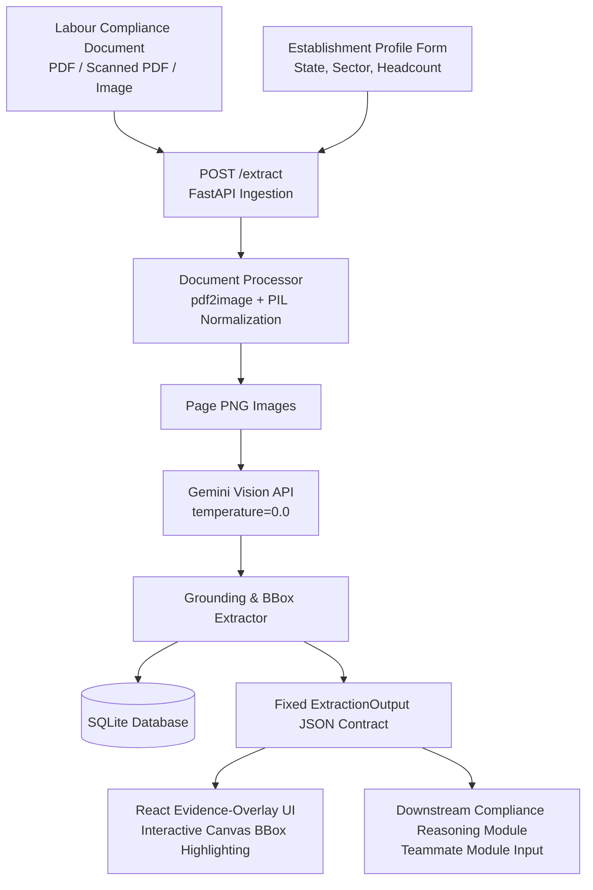

# PS-05 Document Intelligence Module
### Digital Shram Sankalp Ideathon 2026 — Ministry of Labour & Employment, India

This repository contains the standalone **Document Intelligence & Evidence Grounding Module** built for Problem Statement PS-05.

---

## 🎯 Purpose & Scope

The **Document Intelligence Module** ingests real-world labour-compliance documents (photographed register pages, clean PDFs, scanned PDFs) along with an establishment profile, and transforms them into a clean, structured, evidence-linked `ExtractionOutput` JSON record.

Every extracted compliance field is strictly grounded with:
1. **Target Field Name** (canonical field vocabulary)
2. **Extracted Value**
3. **Visual Evidence**: Page number, precise normalized bounding box `[x, y, w, h]` (% relative to image bounds), and raw text snippet
4. **Extraction Confidence**: `"high"`, `"medium"`, or `"low"`
5. **Document Quality Score**: Overall legibility rating `0.0–1.0` and list of detected visual defects (e.g. blur, handwriting, occlusion)

---

## 🏗️ Architecture Overview



---

## 📐 Fixed Output Contract (`ExtractionOutput` Schema)

This is the fixed JSON shape produced by this module and consumed by downstream compliance reasoning modules:

```typescript
interface ExtractionOutput {
  document_id: string;
  establishment_profile: {
    state: string;
    sector: string;
    headcount: number | null;
    contractor_involved: boolean | null;
    worker_type: string | null;
  };
  document_quality: {
    overall_score: number;        // Float 0.0 to 1.0
    issues: string[];            // e.g. ["page 1 blurred", "handwriting low legibility"]
  };
  fields: Array<{
    field_id: string;            // Unique within document, e.g. "f1", "f2"
    name: string;                // Canonical field name (e.g. "monthly_wage")
    value: string;               // Extracted value
    evidence: {
      page: number;              // >= 1
      bbox: [number, number, number, number]; // [x, y, w, h] normalized percentages (0-100)
      text_snippet: string;      // Raw text snippet read from region
    };
    extraction_confidence: "high" | "medium" | "low";
  }>;
}
```

---

## 🧪 Test Fixtures & Sample `ExtractionOutput` JSON Outputs

Below are concrete example JSON records produced from the 3 included test fixtures in `backend/test_fixtures/`:

### Fixture 1: Photographed Wage Register (`wage_register_blurred.jpg`)
> **Demonstrates**: Blurred photo handling, handwritten registers, low legibility score, low confidence flags.

```json
{
  "document_id": "doc_wage_blurred_001",
  "establishment_profile": {
    "state": "Maharashtra",
    "sector": "Textile Factory",
    "headcount": 85,
    "contractor_involved": false,
    "worker_type": "Unskilled"
  },
  "document_quality": {
    "overall_score": 0.58,
    "issues": [
      "page 1 blurred and handwriting low legibility",
      "uneven illumination in bottom left corner"
    ]
  },
  "fields": [
    {
      "field_id": "f1",
      "name": "employee_monthly_wage",
      "value": "Rs. 18,500",
      "evidence": {
        "page": 1,
        "bbox": [12.0, 24.5, 32.0, 6.0],
        "text_snippet": "Emp Monthly Wage: Rs. 18500 (approx)"
      },
      "extraction_confidence": "low"
    },
    {
      "field_id": "f2",
      "name": "overtime_hours",
      "value": "14.5 hrs",
      "evidence": {
        "page": 1,
        "bbox": [46.0, 31.0, 25.0, 5.5],
        "text_snippet": "OT Hours: 14.5"
      },
      "extraction_confidence": "low"
    },
    {
      "field_id": "f3",
      "name": "overtime_pay",
      "value": "Rs. 2,400",
      "evidence": {
        "page": 1,
        "bbox": [72.0, 31.0, 22.0, 5.5],
        "text_snippet": "OT Pay: 2400"
      },
      "extraction_confidence": "medium"
    },
    {
      "field_id": "f4",
      "name": "gross_wages",
      "value": "Rs. 20,900",
      "evidence": {
        "page": 1,
        "bbox": [12.0, 52.0, 35.0, 7.0],
        "text_snippet": "Gross Wages: 20,900"
      },
      "extraction_confidence": "medium"
    },
    {
      "field_id": "f5",
      "name": "total_deductions",
      "value": "Rs. 1,800",
      "evidence": {
        "page": 1,
        "bbox": [50.0, 52.0, 30.0, 7.0],
        "text_snippet": "Deductions (PF/ESI): 1,800"
      },
      "extraction_confidence": "high"
    }
  ]
}
```

---

### Fixture 2: Safety Inspection Report (`safety_inspection_clean.pdf`)
> **Demonstrates**: Clean digital PDF, 100% confidence, hazardous process flags, safety committee records.

```json
{
  "document_id": "doc_safety_clean_002",
  "establishment_profile": {
    "state": "Maharashtra",
    "sector": "Chemical Manufacturing",
    "headcount": 45,
    "contractor_involved": false,
    "worker_type": "Hazardous"
  },
  "document_quality": {
    "overall_score": 0.98,
    "issues": []
  },
  "fields": [
    {
      "field_id": "f1",
      "name": "safety_committee_record",
      "value": "Form-12 Safety Inspection Completed - Compliant",
      "evidence": {
        "page": 1,
        "bbox": [15.0, 18.0, 68.0, 8.5],
        "text_snippet": "Safety Committee Meeting Record & Inspection: Satisfactory"
      },
      "extraction_confidence": "high"
    },
    {
      "field_id": "f2",
      "name": "health_examination_record",
      "value": "Annual Medical Exam Conducted for 45 Workers",
      "evidence": {
        "page": 1,
        "bbox": [15.0, 32.0, 70.0, 7.0],
        "text_snippet": "Health Examination Record: Certified Fit by Factory Medical Officer"
      },
      "extraction_confidence": "high"
    },
    {
      "field_id": "f3",
      "name": "accident_record",
      "value": "0 Fatalities, 1 Minor Incident Logged",
      "evidence": {
        "page": 1,
        "bbox": [15.0, 44.0, 60.0, 6.5],
        "text_snippet": "Accident Register (Form 24): 1 minor injury, 0 lost-time accidents"
      },
      "extraction_confidence": "high"
    },
    {
      "field_id": "f4",
      "name": "hazardous_process_flag",
      "value": "True - Chemical Storage Section Designated",
      "evidence": {
        "page": 1,
        "bbox": [15.0, 56.0, 65.0, 6.0],
        "text_snippet": "Hazardous Process Operations: Schedule III Applied"
      },
      "extraction_confidence": "high"
    },
    {
      "field_id": "f5",
      "name": "headcount",
      "value": "45",
      "evidence": {
        "page": 1,
        "bbox": [15.0, 67.0, 35.0, 5.5],
        "text_snippet": "Total On-roll Workers Present: 45"
      },
      "extraction_confidence": "high"
    }
  ]
}
```

---

### Fixture 3: Factory Registration & License (`factory_license_scanned.pdf`)
> **Demonstrates**: Scanned document with stamps, contract labour license, ISMW migrant worker counts.

```json
{
  "document_id": "doc_license_scanned_003",
  "establishment_profile": {
    "state": "Maharashtra",
    "sector": "Automobile Factory",
    "headcount": 250,
    "contractor_involved": true,
    "worker_type": "Skilled"
  },
  "document_quality": {
    "overall_score": 0.88,
    "issues": [
      "stamp seal partially covering text in header"
    ]
  },
  "fields": [
    {
      "field_id": "f1",
      "name": "registration_number",
      "value": "LIC/MUM/2025/FL-4402",
      "evidence": {
        "page": 1,
        "bbox": [10.0, 12.0, 45.0, 6.5],
        "text_snippet": "Factory Registration No: LIC/MUM/2025/FL-4402"
      },
      "extraction_confidence": "high"
    },
    {
      "field_id": "f2",
      "name": "contractor_license_record",
      "value": "License No: CL/2024/9918 Valid till 31-Dec-2026",
      "evidence": {
        "page": 1,
        "bbox": [10.0, 24.0, 75.0, 7.0],
        "text_snippet": "Contract Labour License: CL/2024/9918 Valid"
      },
      "extraction_confidence": "high"
    },
    {
      "field_id": "f3",
      "name": "contract_labour_count",
      "value": "120",
      "evidence": {
        "page": 1,
        "bbox": [10.0, 35.0, 40.0, 5.5],
        "text_snippet": "Maximum Contract Workers Permitted: 120"
      },
      "extraction_confidence": "high"
    },
    {
      "field_id": "f4",
      "name": "ismw_count",
      "value": "25",
      "evidence": {
        "page": 1,
        "bbox": [10.0, 44.0, 45.0, 5.5],
        "text_snippet": "Inter-State Migrant Workmen Employed: 25"
      },
      "extraction_confidence": "medium"
    },
    {
      "field_id": "f5",
      "name": "ismw_compliance_record",
      "value": "Passbook and Displacement Allowance Verified",
      "evidence": {
        "page": 1,
        "bbox": [10.0, 53.0, 78.0, 7.5],
        "text_snippet": "ISMW Compliance: Passbook issued, journey allowance paid"
      },
      "extraction_confidence": "high"
    }
  ]
}
```

---

## 🚀 Quick Start Guide

### 1. Backend Setup & API Server
```bash
cd backend

# Install dependencies
pip install -r requirements.txt

# Generate test fixtures
python generate_fixtures.py

# Run automated tests
$env:PYTEST_DISABLE_PLUGIN_AUTOLOAD=1; python -m pytest tests/ -v

# Start FastAPI server on http://localhost:8000
python run.py
```

### 2. Frontend React Setup
```bash
cd frontend

# Install npm dependencies
npm install

# Start Vite dev server on http://localhost:5173
npm run dev
```

---

## ⚡ Live Demo Instructions
1. Open `http://localhost:5173` in your browser.
2. Click any of the **3 Preset Sample Buttons** ("Photographed Wage Register", "Safety Inspection Report", "Factory License") to test extraction instantly.
3. Observe:
   - **Page Viewport**: Rendered document page image overlaid with SVG bounding box rectangles.
   - **Cross-Highlighting**: Click any extracted field card on the right to trigger an animated glowing pulse highlight on its exact location on the document image!
   - **Legibility Score Card**: Real-time 0-100% legibility gauge & quality issue alerts.
   - **Copy JSON Contract**: Click "Copy JSON Contract" button to export the JSON record directly for integration with your companion COMPLIANCE REASONING module.
